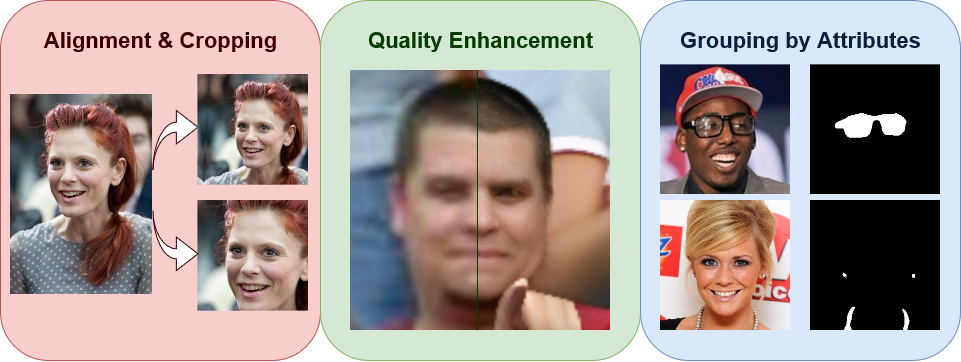

.. Face Crop Plus documentation master file, created by
   sphinx-quickstart on Thu Apr 20 15:16:01 2023.
   You can adapt this file completely to your liking, but it should at least
   contain the root `toctree` directive.

Face Crop Plus
==============

About
-----

Image preprocessing package for automatic face alignment and cropping with additional features. It provides the following functionality:

   1. **Face cropping** - face alignment and center-cropping using facial landmarks. Landmarks can be automatically predicted or, if they are already know, can be supplied through a separate file. It is possible to specify face factor, i.e., face area relative to the cropped image, and face extraction strategy, e.g., all faces or largest face per image.
   2. **Face enhancement** - face image quality enhancement. If images are blurry or contain many small faces, quality enhancement model can be used to make the images clearer. Small faces in the image are automatically checked and enhanced if desired.
   3. **Face parsing** - face attribute parsing and cropped image grouping to sub-directories. Face images can be grouped according to some facial attributes or some combination, such as *glasses*, *earrings and necklace*, *hats*. It is also possible to generate masks for facial attributes or some combination of them, for instance, *glasses*, *nose*, *nose and eyes*.

Please see :doc:`references` section for more details about which models are used for each feature.

.. note:: 
   Each feature can be used separately, e.g., if you just need to enhance the quality of blurry photos, or if you just need to generate attribute masks (like hats, glasses, face parts).

.. toctree::
   :maxdepth: 2
   :caption: Contents:

   install
   features
   examples
   cli
   modules
   support
   references
   citation

Indices and Tables
------------------

* :ref:`genindex`
* :ref:`modindex`
* :ref:`search`
